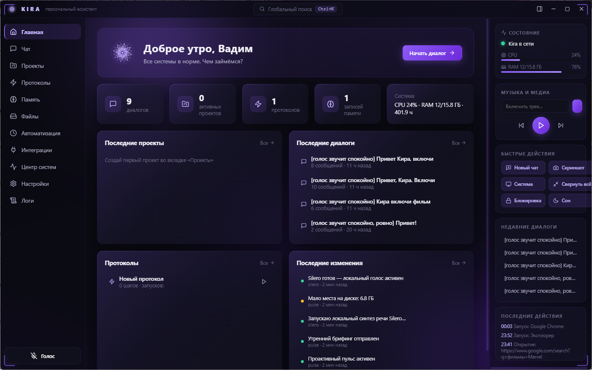
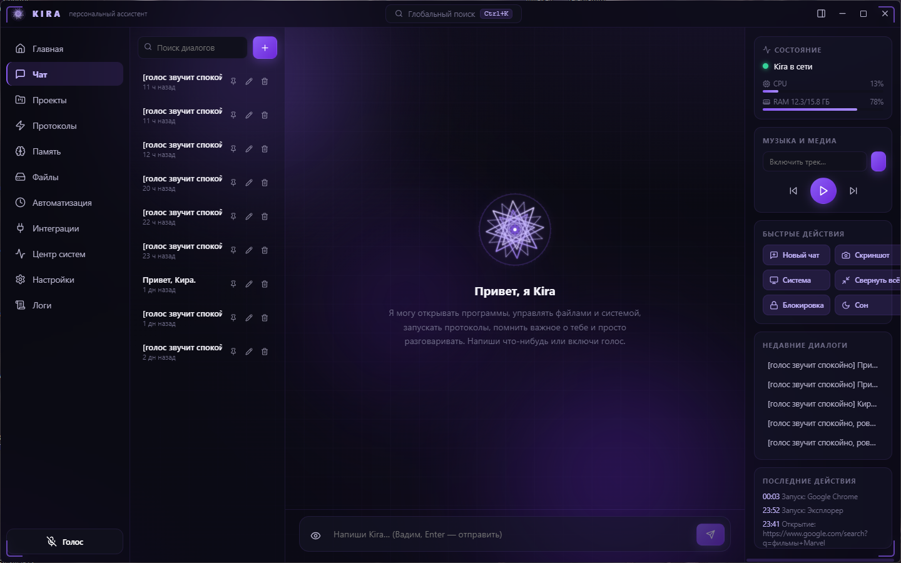

<div align="center">


# Kira

### Твой личный ИИ-помощник для Windows

*Голосовой ассистент с характером: понимает обычную речь, управляет
компьютером, отвечает на вопросы, помнит тебя и помогает по мелочи и по-крупному.*
*Просто скажи — и она сделает.*

<br>


</div>

---

<div align="center">

**Кира — не просто чат.** Она реально *делает* все на твоём компьютере:
открывает программы, включает музыку, ищет, считает, наводит порядок —
голосом или текстом, быстро и по твоей команде.

</div>

---

## 🖼 Как выглядит

<p align="center">
  
  <br><em>Главный экран: всё под рукой — статус, диалоги, быстрые действия</em>
</p>

<p align="center">
  
  <br><em>Живой чат с фирменной эмблемой Kira</em>
</p>

---

## 💬 Что можно ей сказать

Говори обычными словами — Кира поймёт. Несколько примеров:

> 🎵 «Кира, включи музыку» · «сделай потише» · «следующий трек»
>
> 💻 «открой браузер» · «запусти калькулятор» · «сделай скриншот» · «сверни все окна»
>
> 🌤 «какая погода» · «сколько времени» · «сколько заряда осталось»
>
> 🧮 «переведи 100 долларов в рубли» · «курс биткоина» · «5 миль в километрах»
>
> ⏰ «поставь таймер на 10 минут» · «напомни позвонить маме через час»
>
> 🔎 «загугли рецепт борща» · «найди на ютубе обзор ноутбука»
>
> 🧹 «наведи порядок в загрузках» — большую задачу Кира сделает **в фоне**, пока вы болтаете
>
> ✍️ «напиши письмо другу» · «объясни, что значит эта ошибка» — тут подключится ИИ

**Больше 70 команд** Кира выполняет сама, мгновенно, даже без интернета. А для
сложного — думает, ищет и пишет с помощью нейросети.

---

## 🎭 Выбери характер

Характер Киры меняется одним кликом — 7 готовых образов, каждый со своим стилем
общения и голосом. Или настрой свой.

⭐ **Кира** · 💜 **Друг** · 💼 **Деловой** · 🎩 **Дворецкий**
😜 **Игривая** · 🌷 **Заботливая** · ⚡ **Минимал**

Со временем Кира запоминает твои привычки и становится всё более «своей».

---

## 🎙 Голос

Кира и слышит, и говорит:
- **Слушает** — просто скажи «Кира», можно перебивать её на полуслове;
- **Говорит** живым нейросетевым голосом (Silero, работает офлайн);
- **Понимает речь** даже без интернета (запасной офлайн-режим).

Голоса на выбор: *xenia, kseniya, baya, aidar, eugene* — плюс облачный голос
«Светлана» и системные голоса Windows.

---

## 🧠 Что ещё умеет

- **Видит экран** — можно спросить «что тут на экране?» или попросить помочь с тем, что видит.
- **Помнит тебя** — важные факты, предпочтения, твой профиль. Не нужно повторять по кругу.
- **Учится новому** — «запомни, как я это делаю» → Кира создаст навык и будет повторять сама.
- **Работает в фоне** — долгую задачу уносит в фон и сообщает, когда готово.
- **Проактивна** — утренний брифинг, напоминания, заботливые подсказки.
- **Интеграции** — Obsidian, Notion, Google Календарь, Gmail, Discord, Telegram.

---

## 🤖 Какой ИИ выбрать

Кире можно подключить один из провайдеров — у каждого есть бесплатный доступ.
Ключ вставляется в **Настройки → Модели ИИ**.

| Провайдер | Чем хорош | Где взять ключ |
|-----------|-----------|----------------|
| **Groq** *(рекомендуется)* | Бесплатно, очень быстро + голос | [console.groq.com/keys](https://console.groq.com/keys) |
| **OpenRouter** | Много бесплатных моделей (с пометкой `:free`) | [openrouter.ai/keys](https://openrouter.ai/keys) |
| **Google Gemini** | Щедрый бесплатный доступ, хорошо «видит» экран | [aistudio.google.com/apikey](https://aistudio.google.com/apikey) |
| **DeepSeek** | Мощный и недорогой | [platform.deepseek.com](https://platform.deepseek.com/api_keys) |
| **Ollama** | Полностью локально, без интернета | [ollama.com](https://ollama.com) |

> 🔒 **Приватность.** Все твои данные хранятся только на твоём компьютере.
> В интернет уходят лишь сами вопросы к выбранному ИИ — и только когда без него не обойтись.

---

<details>
<summary><b>⚙️ Как это устроено (для любопытных и разработчиков)</b></summary>

<br>

Kira — **не обёртка над ChatGPT**, а самостоятельная платформа. Философия
**Local First**: всё, что можно сделать локально, ядро делает само — мгновенно,
офлайн и бесплатно. Нейросеть подключается только тогда, когда задача
действительно требует «подумать».

```
   Пользователь · чат / голос / hotkey / автоматизация / агент
                              │
                              ▼
        ┌─────────────────────────────────────────────┐
        │              INTENT PARSER                   │
        │   1. Точные шаблоны (regex)  — мгновенно      │
        │   2. Семантика (эмбеддинги)  — по смыслу      │
        └─────────────────────────────────────────────┘
                              │  распознано локально
                              ▼
        ┌─────────────────────────────────────────────┐
        │             COMMAND ENGINE                   │
        │   валидация · подтверждение опасного ·        │
        │   исполнение · история · отмена (undo)        │
        └─────────────────────────────────────────────┘
                              │
                              ▼
        ┌─────────────────────────────────────────────┐
        │       ACTION API  ·  70 действий             │
        │   единый контракт: execute / undo / validate  │
        └─────────────────────────────────────────────┘
                              │
                              ▼
     CONTROLLERS · Browser · Application · Media · File · Power · Window ·
              Input · Search · Clipboard · System · Notification · Git
                              │
                              ▼
                          Windows

                   ↘  (не распознано локально)
       AI Router → LLM-конвейер → те же Actions через протокол [[kira:…]]
```

**Семантический слой** сравнивает фразу с эмбеддингами команд (модель
`paraphrase-multilingual-MiniLM`, локально и офлайн), поэтому «сделай погромче» или
«что там с погодой» срабатывают локально даже без точного шаблона. Порог подобран
ради высокой точности: лучше честно отдать запрос нейросети, чем выполнить не то.

**Агент** встроен в ядро: долгую цель Кира уносит в фон (диалог не блокируется), а
узкую подзадачу поручает фокусному суб-агенту. Это не «рой» — две управляемые,
отлаживаемые вещи.

```
src/
├── shared/            Общие типы, пресеты личностей
├── main/
│   ├── core/          ★ KIRA CORE — сердце платформы
│   │   ├── intent.ts          Intent Parser (regex)
│   │   ├── semanticIntent.ts  Семантический слой (эмбеддинги)
│   │   ├── engine.ts          Command Engine
│   │   ├── registry.ts        Реестр команд
│   │   ├── actions/           Action API — все возможности
│   │   └── controllers/       Доменные контроллеры
│   └── modules/
│       ├── ai/        AI Router: LLM, личность, память, голос, зрение, агенты
│       ├── system.ts  Драйвер Windows (экран, процессы, ввод)
│       └── utilities.ts · abilities.ts · automation.ts …
├── preload/           Безопасный мост window.kira
└── renderer/          React-интерфейс
```

**Стек:** Electron 33 · React 18 · TypeScript · локальные Python-подсистемы
(голос Silero, распознавание Vosk, эмбеддинги fastembed).

**Сборка из исходников:**
```bash
npm install
npm run dev          # запуск в режиме разработки
npm run test:core    # тесты ядра (86 интентов + движок)
npm run dist         # установщик Windows
```

</details>

---

## 📄 Лицензия

**Проприетарная** — личный проект автора. Разрешено личное некоммерческое
использование и ознакомление с кодом. Коммерческое использование, распространение
и включение в другие проекты — только с письменного разрешения автора.
Подробнее — в файле [LICENSE](LICENSE).

<div align="center">
<br>

**© 2026 VirusAid (D3F0LT). Все права защищены.**

<sub>Сделано с ⭐ для тех, кто хочет собственного ИИ — а не подписку на чужой.</sub>

</div>
